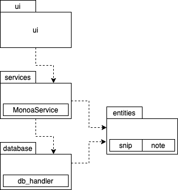
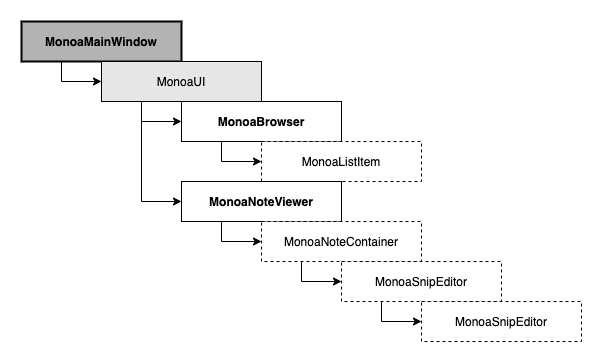

# Arkkitehtuurikuvaus

## Rakenne

Sovelluksen rakenne jakaantuu kolmeen osaan:

_ui_ -moduuli sisältää sovelluksen käyttöliittymäkoodin jaettuna luokittain eri alimoduleihin.
_monoaservice_ -moduuli sisältää sovelluslogiikan ja toimii viestinviejänä tasojen 1 ja 3 välillä.
_entities_ -moduuli pitää sisällään sovelluksessa käytetyt objektiluokat.
_database_ -moduuli vastaa sovelluksen datan tallentamisesta tietokantatiedostoon.

## Käyttöliittymä

Sovelluksen käyttöliittymä koostuu kahdeksasta luokasta, joilla jokaisella on oma vastuualue sovelluksen
toiminnallisuuksien visualisoinnissa.

1. MonoaMainWindow
   - Sovellusikkunan "kattoluokka", joka piirtää sovellusikkunan sekä jakaa sen kahteen osaan:
     - Sovelluksen käyttöliittymä (MonoaUI)
     - Statuspalkki
     - (jatkossa myös mahdollisesti työkalupalkki)

2. MonoaUI
   - Käyttöliittymän "kattoluokka", joka jakaa näkymän kahteen alaluokkaan:
     - MonoaBrowser
     - MonoaNoteViewer

3. MonoaBrowser
   - MonoaBrowser vastaa notes-listauksen piirtämisestä ja toiminnallisuuksista.

4. MonoaListItem
   - MonoaListItem vastaa notes-listauksen yksittäisen noten esittämisestä sekä muutosten kommunikoinnista 
   editorin ja sovelluslogiikan suuntaan.

5. MonoaNoteViewer
   - Vastaa muokattavaksi valitun noten sisällön ja toiminnallisuuksien piirtämisestä.

6. MonoaNoteContainer
   - Vastaa snip-objektien esittämisestä listana muokkauksen alla olevan noten sisällä sekä snipeihin 
   kohdistuvista toiminnallisuuksista.

7. MonoaSnipEditor
   - Vastaa yksittäisen noten sisältämän snipin piirtämisestä tietoineen ja toiminnallisuuksineen.

8. MonoaTextEdit
   - Custom PyQt-luokka QTextEdit-luokan pohjalta, joka tarjoaa dynaamisesti tekstisisällön mukaan 
   venyvän tekstieditorin sekä aktiivisen rivin korostustoiminnallisuuden.
